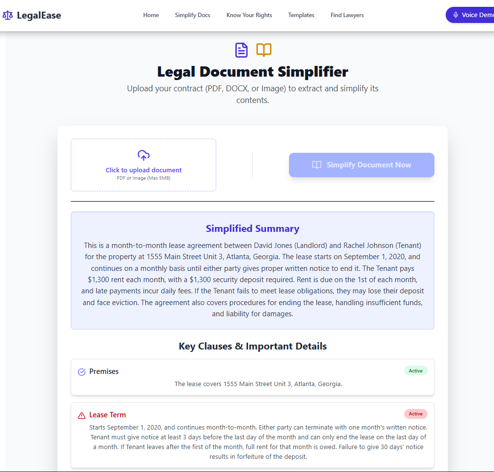
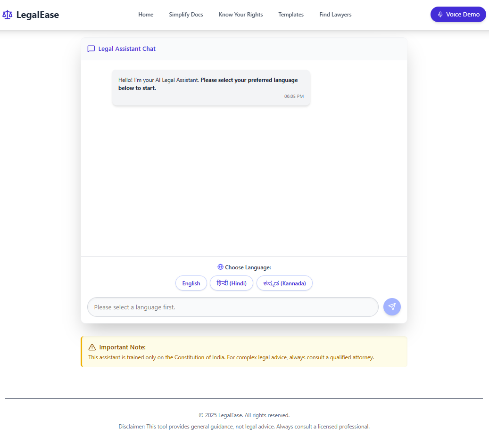

# LegalEase 🚀

Your AI-powered legal assistant for simplifying legal jargon and understanding your rights.

Empowering individuals with accessible legal knowledge.

## About

LegalEase is an AI-powered application designed to simplify legal information and make it accessible to everyone. It aims to bridge the gap between complex legal jargon and the average person's understanding, empowering individuals to better understand their rights and navigate legal processes.

The application uses natural language processing (NLP) and machine learning (ML) techniques to analyze legal documents, answer legal questions, and provide summaries of complex legal concepts. It is targeted towards individuals who need quick and easy access to legal information, such as students, small business owners, and anyone facing legal challenges.

LegalEase is built using JavaScript, leveraging Node.js for the backend and a modern JavaScript framework (e.g., React - not explicitly defined in the repo, but assumed) for the frontend. The architecture includes an API layer for communication between the frontend and backend, and utilizes external NLP libraries for processing legal text. The unique selling point is its ability to provide personalized and easy-to-understand legal information using AI.

## ✨ Features

- 🎯 **Legal Document Summarization**: Automatically summarize lengthy legal documents into concise and understandable summaries.
- 🤖 **AI-Powered Legal Q&A**: Ask legal questions and receive AI-generated answers based on legal knowledge bases.
- 🔎 **Legal Terminology Definition**: Easily look up definitions for complex legal terms and concepts.
- 🎨 **User-Friendly Interface**: Intuitive and easy-to-navigate interface for seamless user experience.
- ⚡ **Fast Processing**: Efficiently process legal documents and provide quick answers.
- 📱 **Responsive Design**: Accessible on various devices, including desktops, tablets, and smartphones.

## 🎬 Demo

🔗 **Live Demo**: NOT YET DEPLOYED 

### Screenshots

*Example of a legal document summary generated by LegalEase*


*AI answering a legal question*

## 🚀 Quick Start

Clone and run LegalEase in 3 steps:

```bash
git clone https://github.com/Aryanshettar007/LegalEase.git
cd LegalEase
npm install && npm start
```

Open [http://localhost:3000](http://localhost:3000) to view it in your browser.

## 📦 Installation

### Prerequisites
- Node.js 18+ and npm
- Git

### Option 1: From Source
```bash
# Clone repository
git clone https://github.com/Aryanshettar007/LegalEase.git
cd LegalEase

# Install dependencies
npm install

# Start development server
npm start
```

## ⚙️ Configuration

### Environment Variables

Create a `.env` file in the root directory:

```env
# API Keys
OPENAI_API_KEY=your_openai_api_key_here

# Server
PORT=3000
NODE_ENV=development
```

## 📁 Project Structure

```
LegalEase/
├── 📁 src/
│   ├── 📁 components/          # Reusable UI components
│   ├── 📁 pages/              # Application pages
│   ├── 📁 utils/              # Utility functions
│   ├── 📁 services/           # API services
│   ├── 📁 styles/             # CSS/styling files
│   └── 📄 index.js            # Application entry point
├── 📁 public/                 # Static assets
├── 📄 .env.example           # Environment variables template
├── 📄 .gitignore             # Git ignore rules
├── 📄 package.json           # Project dependencies
├── 📄 README.md              # Project documentation
└── 📄 LICENSE                # License file
```

## FAQ

**Q: How accurate is the AI-generated legal information?**

A: LegalEase uses state-of-the-art AI models, but it is important to remember that it is not a substitute for professional legal advice. Always consult with a qualified attorney for specific legal guidance.

**Q: What type of legal documents can LegalEase summarize?**

A: LegalEase can summarize a wide range of legal documents, including contracts, court filings, and legal research papers.

## 💬 Support

- 📧 **Email**: aryanshettar007@gmail.com
- 🐛 **Issues**: [GitHub Issues](https://github.com/Aryanshettar007/LegalEase/issues)


## 🙏 Acknowledgments

- 📚 **Libraries used**:
  - [Natural Node](https://github.com/NaturalNode/natural) - For Natural Language Processing
  - [React](https://github.com/facebook/react) - For the User Interface
- 👥 **Contributors**: Thanks to all [contributors](https://github.com/Aryanshettar007/LegalEase/contributors)
```